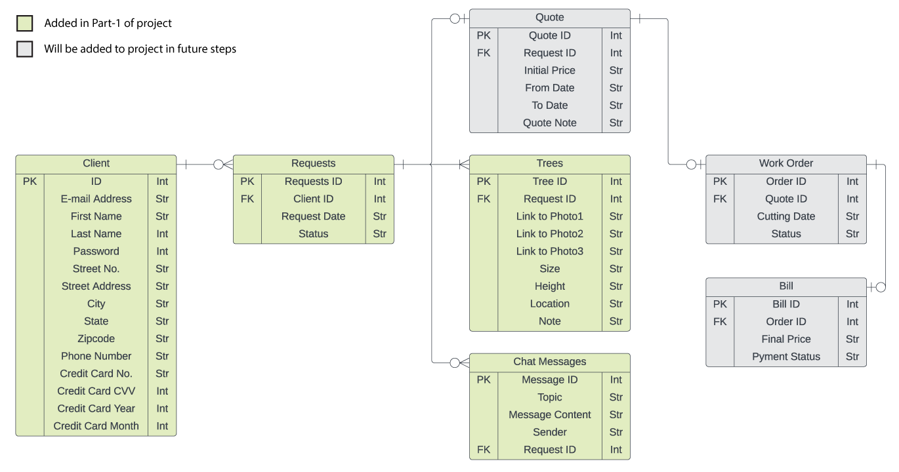

# Database Project
This is our Database Course Project, a website for managing tree-cutting for a contractor
David Smit.

## Entity Relationship Diagram
Our Database design is as follows:

# Installation Guide

Follow these steps to set up your environment. Please ensure you select the correct instructions corresponding to your operating system.

## Prerequisites

1. **Java JDK**: You will need to install [Java Version 20 JDK](https://www.oracle.com/java/technologies/javase/jdk20-archive-downloads.html).

   After installation, set up the environment variable as follows:

   ### Windows

   1. Search for 'Environment Variables' in your start menu and select 'Edit the system environment variables'
   2. In the System Properties window, click on 'Environment Variables...'
   3. In the 'System variables' section, click on 'New' and add:
      - Variable name: `JAVA_HOME`
      - Variable value: `path to your JDK installation`
   4. Select 'OK' and close all remaining windows, including the System Properties window.

   > Replace 'path to your JDK installation' with the actual path where the Java JDK was installed on your machine.

2. **Apache Tomcat (Version 9)**: [Apache Tomcat v9](https://tomcat.apache.org/download-90.cgi) required to serve your web applications.

3. **MySQL**: You need [MySQL 8.0](https://dev.mysql.com/downloads/mysql/) to manage your application's database.

4. **Eclipse IDE**: This is the recommended IDE for development.

   - [Download Eclipse](https://www.eclipse.org/downloads/)

## Project Setup

1. **Download Project**: Click [here](https://github.com/3eErfan/Database_Project/archive/refs/heads/main.zip) to download the repository as a ZIP file.

2. **Import Project in Eclipse**:

   1. Open Eclipse IDE.
   2. Go to 'File > Import'.
   3. In the import wizard, select 'Existing Projects into Workspace' under the 'General' category.
   4. Click 'Next'.
   5. Click 'Select archive file' and browse to locate the downloaded ZIP file.
   6. Select the project and click 'Finish'.

You are now ready to start working on your project!

## Contributions of the two team members 
Team member1:
- Database Design (ER Diagram): Designed the Entity-Relationship (ER) diagram, which defines the structure and relationships of the database tables. This includes defining tables like "User," "Requests," "Trees," and "Chats," as well as specifying their attributes and relationships.
- Database Initialization: Implemented the code for initializing the database. This includes creating the necessary tables and populating the initial data.
- User Class Implementation: Wrote the user class, which represents the attributes and behavior of a user. This class includes constructors, getter and setter methods, and SQL queries to interact with the database.
- JSP Pages: Developed the JSP pages for user registration and login. Created the registration form and implemented the logic for users to register and log in. This includes handling form submissions, data validation, and database interactions.
- A significant part of the development efforts was directed towards crafting the User.java class, serving as the core data model for user-related information within the application. This entailed 
  structuring and managing user data, especially in scenarios such as user registration and interaction with the application's database.
- Additionally, played a fundamental role in the implementation of the UserDAO.java class, which acted as a crucial link between the application and the database.
- Their responsibilities included managing database operations and ensuring seamless connectivity for user-specific data, contributing to the robustness of the application's backend functionalities.
-  Implemented User.java and maintained the integrity and organization of user-related information, thereby facilitating various user interactions and operations within the application.
-  Moreover, their contributions to the UserDAO.java class enabled efficient communication with the database, allowing for effective data retrieval, insertion, and management of user-related information.
-  The involvement across these classes was pivotal in shaping a robust foundation for user-centric functionalities and ensuring effective data management, ultimately enhancing the user experience within 
   the application.

Team member 2:
- Servlets and DAO Implementation: Implemented the servlets and data access objects (DAOs) for handling user login and registration. This includes creating the userDAO class to interact with the database and validate user credentials during login.
- Login JSP Page: Developed the JSP page for user login. Designed the login form and implemented the logic for authenticating users based on their email and password. Integrated this with the userDAO class.
- JSP Page for Viewing Data: Created the JSP page for viewing data from the database. This includes displaying a list of users, requests, trees, and chat history. Integrated the JSTL (JavaServer Pages Standard Tag Library) for iterating through data collections and displaying information.
- Collaboration: Worked with Team Member 1 to ensure that the database structure and data initialization aligned with the requirements of the application. This required close coordination to ensure that the data presented in the JSP pages accurately reflected what was stored in the database.
- Orchestrated the development and management of the ControlServlet, focusing on user authentication, registration functionalities, and diverse interfaces for varying user roles within the application.
- Oversaw the routing of user requests to distinct JSP pages, ensuring proper rendering of the user interface and seamless interaction for different user functionalities.
- Played a pivotal role in the creation and enhancement of specific JSP pages tailored to display user-specific information and enable essential user actions within the application.
- Collaborated on the development of robust user authentication, contributing significantly to the backend logic and server-side handling of user interactions and requests.
- Integrated authentication features, registration processes, and user role-specific functionalities within the ControlServlet, ensuring a comprehensive user experience.

Collaborative Work:
- Integration: Collaboratively integrated the user registration and login functionality with the database. This involved ensuring that user data could be inserted into the database during registration and validated during login.
- Data Display: Collaboratively developed the JSP pages to display data from the database. This required ensuring that the JSP pages could retrieve data from the database through the userDAO and present it to the user.
- User Experience: Ensured a cohesive and user-friendly experience by working together on the front-end pages, including the registration and login forms.
- Collaborated on the development and management of the ControlServlet, handling user login, registration, and diverse interfaces for different user roles within the application. This joint effort ensured a comprehensive user experience by integrating various functionalities.
- Worked together on routing user requests to different JSP pages, contributing significantly to the creation of specific JSP pages displaying user-specific information and enabling essential user actions within the application.

